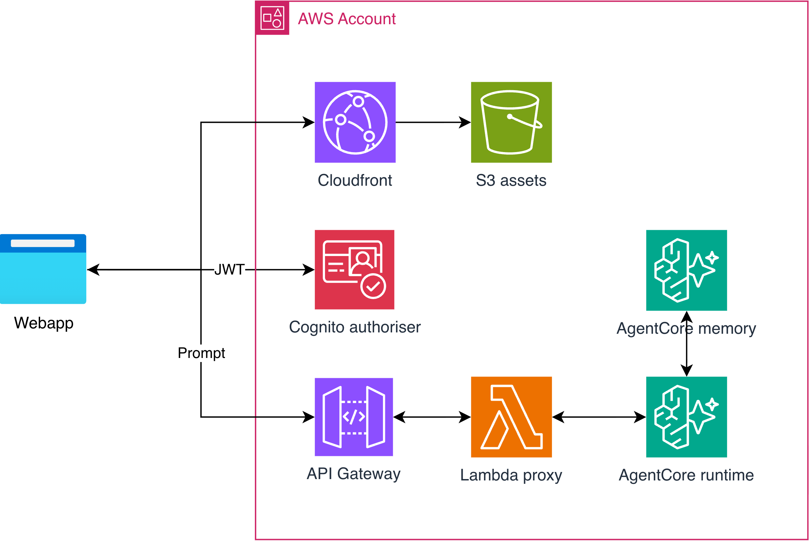

# 🤖 AgentCore Chatbot

A production-ready, serverless chatbot built on [Amazon Bedrock AgentCore](https://aws.amazon.com/bedrock/agentcore/) with a Python backend. It features a streaming chat API, Amazon Cognito authentication, long-term memory, and Amazon Bedrock Guardrails — all wired to an example React frontend that works out of the box.

The frontend is based on the AWS sample [`sample-amazon-bedrock-agentcore-fullstack-webapp`](https://github.com/aws-samples/sample-amazon-bedrock-agentcore-fullstack-webapp).



The backend, frontend, and infrastructure are deployed together via GitHub Actions on every push to `main`.

## Features ✨

### Guardrails 🛡️

This application has guardrails enabled by default on both input and output, so the agent behaves appropriately and avoids generating harmful content. The enabled content filters are:

- 🚫 **Hate**
- 🚫 **Insults**
- 🚫 **Sexual**
- 🚫 **Violence**

They can be configured in [`cdk/stacks/agent_stack.py`](cdk/stacks/agent_stack.py). Learn more in the [Amazon Bedrock Guardrails content filters documentation](https://docs.aws.amazon.com/bedrock/latest/userguide/guardrails-content-filters.html).

### Long-term memory 🧠

This application uses [Amazon Bedrock AgentCore Memory](https://docs.aws.amazon.com/bedrock-agentcore/latest/devguide/memory.html) with the **user preference** memory strategy enabled. The agent stores and recalls user preferences across sessions, and the implementation is extended in [`agent/memory.py`](agent/memory.py).

## One-time setup ⚙️

### Prerequisites
- Python 3.11+, Node.js 22+, Docker Desktop
- AWS CLI configured (`aws configure sso`)

### AWS setup
1. **Enable Bedrock model access** for the model in `agent/agent.py` in your target region via the AWS console.

2. **Bootstrap CDK** (once per account/region):
```bash
cd cdk && cdk bootstrap --context stage=dev
```

### GitHub Actions (CI/CD)
The workflow at `.github/workflows/deploy.yml` deploys the backend and updates the frontend on every push to `main` using OIDC.

1. **Create the IAM role** using the provided script (minimum permissions — the role can only assume CDK bootstrap roles):
   ```bash
   ./scripts/create-github-actions-role.sh --region eu-west-1
   ```
   The repo is auto-detected from `git remote origin`. The role is named `github-actions-<repo-name>`. The script prints the ARN when done.
2. **Add secret** `AWS_ROLE_ARN` in your GitHub repo settings → Secrets.
3. **Set your region and stage** in the workflow:
```yaml
env:
  AWS_REGION: eu-west-1
  STAGE: prod
```

On the next push to `main`, the workflow will deploy the backend and update the frontend.

---

## Deployment 🚀

The CI/CD pipeline will deploy the backend and frontend automatically to your production environment. Manual deployment can also be done, and is often useful for iterative development.

The easiest way to manually deploy your resources is to deploy the backend **and** frontend in one go:
```bash
./scripts/deploy.sh --stage <your-stage-name>
```
Note: your stage name here needs to be different from the CI/CD stage name to avoid conflicts.


### Backend only

You can also only deploy the backend resources in isolation.

First ensure the virtual environment is activated with the required dependencies:

```bash
cd cdk
python -m venv .venv && source .venv/bin/activate
pip install -r requirements.txt
``` 

Then deploy using
```bash
cdk deploy --context stage=<your-stage-name>
```

### Frontend only

The React frontend (Vite + Cloudscape) needs to be deployed separately after the backend deployment.

```bash
./scripts/deploy_frontend.sh --stage <your-stage-name>
```

This runs `generate_env.sh` → `build-frontend.sh` → `sync_frontend.sh` in order.

### Local dev

You can run a frontend locally, rather than deploying the cloudfront distribution to S3.

First ensure you have the correct environment variables set up in `frontend/.env.local`:

```bash
cp frontend/.env.example frontend/.env.local
# Fill in VITE_API_GATEWAY_URL, VITE_USER_POOL_ID, VITE_USER_POOL_CLIENT_ID
```

Run the local server:
```bash
cd frontend && npm run dev
```
